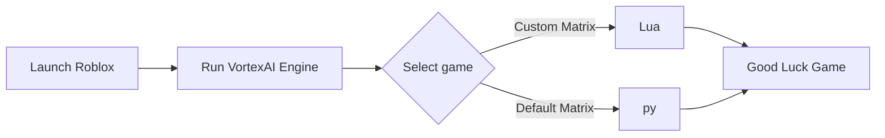

  

---

## ⚙️ Workflow Diagram

## 🛠 Features

Luau Script Workbench: Built-in editor with syntax highlighting, quick preset loading, and direct script execution simulation thread.

Spatial Telemetry & Radar: Real-time vector coordinate mapping, entity proximity scanning, and spatial diagnostic overlays.

Physics & Movement Simulation: Configurable velocity multipliers, jump parameters, and movement calibration helpers for Luau physics testing.

Modular Preset Selector: Quick switching between custom game presets and scripting templates (Blox Fruits, Pet Simulator X, Blade Ball, Universal ESP).

Modern Frameless UI: Single-file Python/pywebview architecture featuring hardware-accelerated rendering, ambient glows, and interactive diagnostic logs.
  
---

`roblox`,  `yolov8`, `automation`, `automation-framework`, `real-time-processing`, `lua`, `object-detection` , `game-scripts` , `murder-mystery` , `mm2` , `blade-ball` , `blox-fruits-game` , `adopt-me-script-lua` , `steal-a-brainrot-game`

> 💡 *IT Quote:* "_Experience is the name everyone gives to their mistakes. – Oscar Wilde_"
